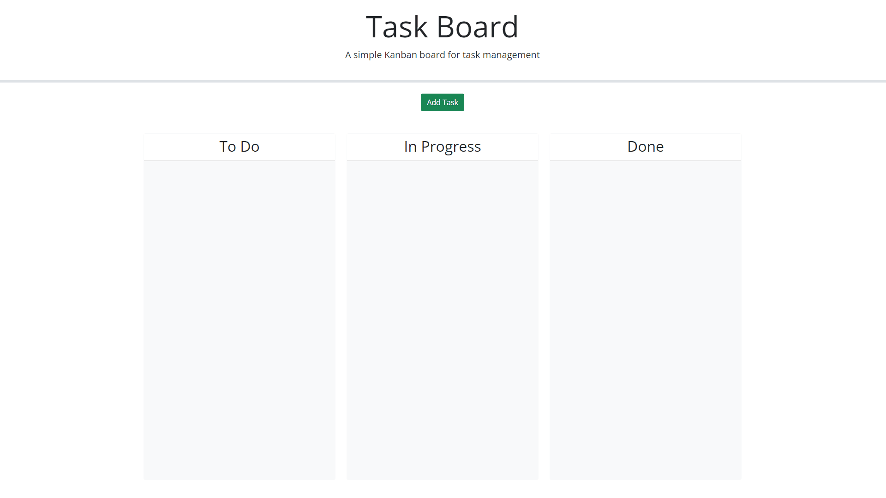

# Project-Taskboard

## User Story

```md
AS A project team member with multiple tasks to organize
I WANT a task board 
SO THAT I can add individual project tasks, manage their state of progress and track overall project progress accordingly
```

## Description

This project is to create an task board that can be used to organized projects by users. It does this by having three separate columns of "To Do, In Progress, and Done" which when the cards are created can be dragged to. Each task card features a title, description and due date. The cards will change colour when due date

## Usage

```md
GIVEN a task board to manage a project
WHEN I open the task board
THEN the list of project tasks is displayed in columns representing the task progress state (Not Yet Started, In Progress, Completed)
WHEN I view the task board for the project
THEN each task is color coded to indicate whether it is nearing the deadline (yellow) or is overdue (red)
WHEN I click on the button to define a new task
THEN I can enter the title, description and deadline date for the new task into a modal dialog
WHEN I click the save button for that task
THEN the properties for that task are saved in localStorage
WHEN I drag a task to a different progress column
THEN the task's progress state is updated accordingly and will stay in the new column after refreshing
WHEN I click the delete button for a task
THEN the task is removed from the task board and will not be added back after refreshing
WHEN I refresh the page
THEN the saved tasks persist
```

## Features

- A board where users can create task cards to organize their schedule
- Cards feature a Name, Description and Due date
- Cards change color based on when they're due.

## Mockup



## Credits
- Edward Lawrence

## License
[](https://opensource.org/licenses/MIT)

## Project URL and Repository Link

- URL - https://zedevgit.github.io/Project-Taskboard/
- Repo - https://github.com/ZeDevGit/Project-Taskboard